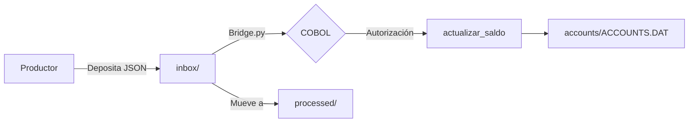

# Sistema Bancario Simulado - COBOL + Python + Kafka

[](https://github.com/LexLuthorPrimero/cobol-kafka-bank/actions)
[](https://opensource.org/licenses/MIT)
[]()

Proyecto demostrativo de un sistema bancario transaccional con procesamiento batch y online, integrando COBOL ANSI-85, Python y Apache Kafka.

## Arquitectura (Modo Archivos)


## Tecnologías
- **COBOL ANSI-85** (GnuCOBOL)
- **Python** (bridge, productor)
- **Apache Kafka** (opcional)
- **Docker** (contenedores)
- **CI/CD** (GitHub Actions)

## Ejecución Rápida (Modo Archivos)
```bash
git clone https://github.com/LexLuthorPrimero/cobol-kafka-bank.git
cd cobol-kafka-bank
docker compose up -d
echo '{"id": 1, "monto": 500}' > inbox/tx-test.json
cat accounts/ACCOUNTS.DAT  # Saldo actualizado
```

## Palabras Clave ATS
`COBOL` `Mainframe` `Batch Processing` `CICS` `DB2` `VSAM` `Python` `Docker` `Kafka` `CI/CD` `Legacy Modernization`
